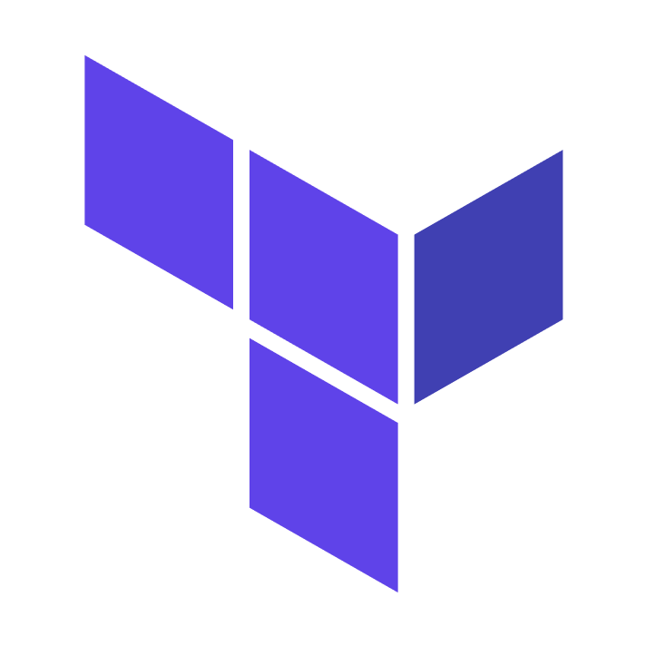

### `$ whoami`
- 👋 Hi, I’m @sivakumarvunnam. I'm **Senior Devops Engineer** at [Avetta](https://www.avetta.com/)
- 👀 I’m interested in DevOps
- 🌱 I’m currently working on **Terraform, AWS, MicroServices, Kubernetes**
- 💞️ I’m looking to collaborate on [Linkedin](https://www.linkedin.com/in/sivakumarvunnam/)
- 📫 How to reach me ...sivakumarvunnam1@gmail.com

### `$ certifications`

- <a href="https://www.credly.com/badges/df6d5e78-c1e1-4b40-abcf-1472b3d17f7f?source=linked_in_profile">&nbsp;CKA: Certified Kubernetes Administrator</a>

### `$ Tools | Technologies | What I use`

        <a href="https://www.python.org/" target="_blank">       </a>                         

 

<!---
sivakumarvunnam/sivakumarvunnam is a ✨ special ✨ repository because its `README.md` (this file) appears on your GitHub profile.
You can click the Preview link to take a look at your changes.
--->
